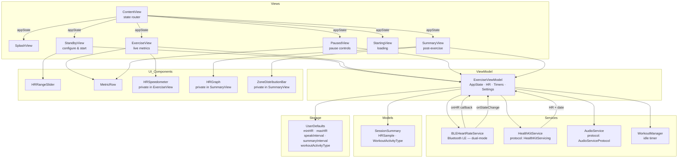
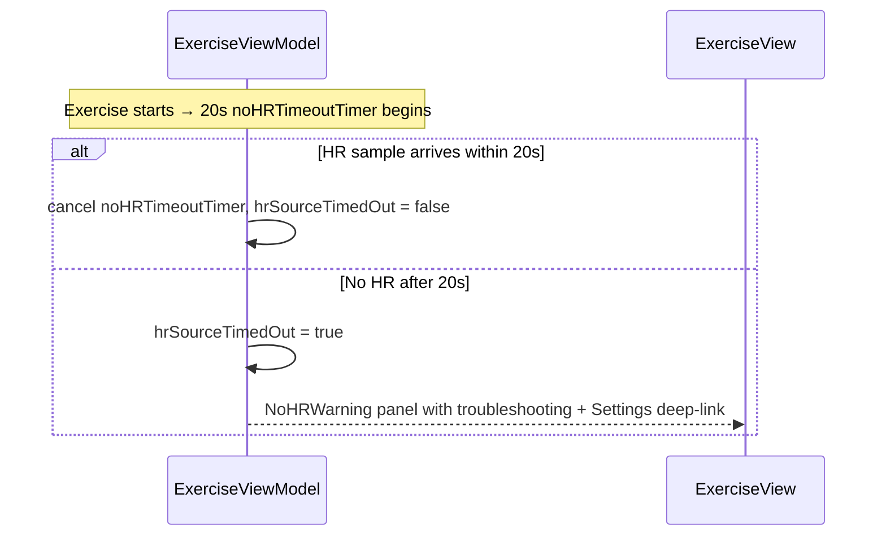
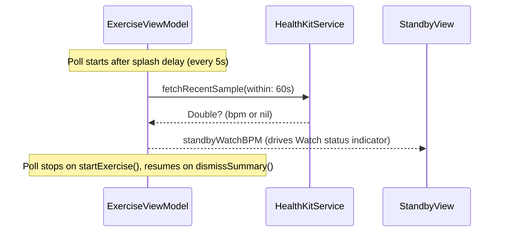
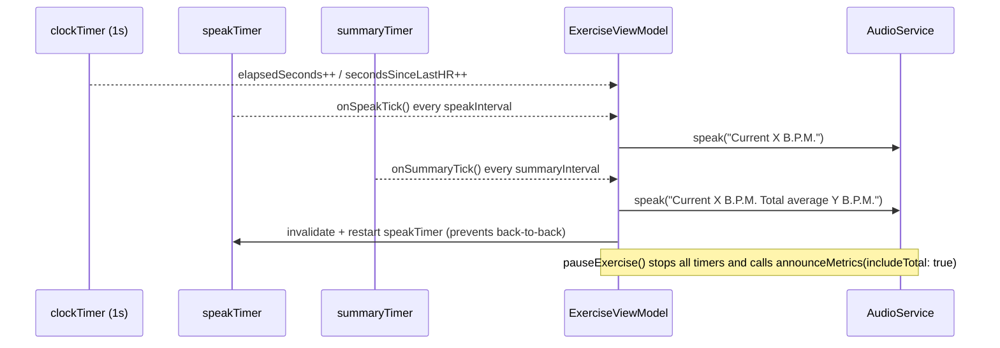
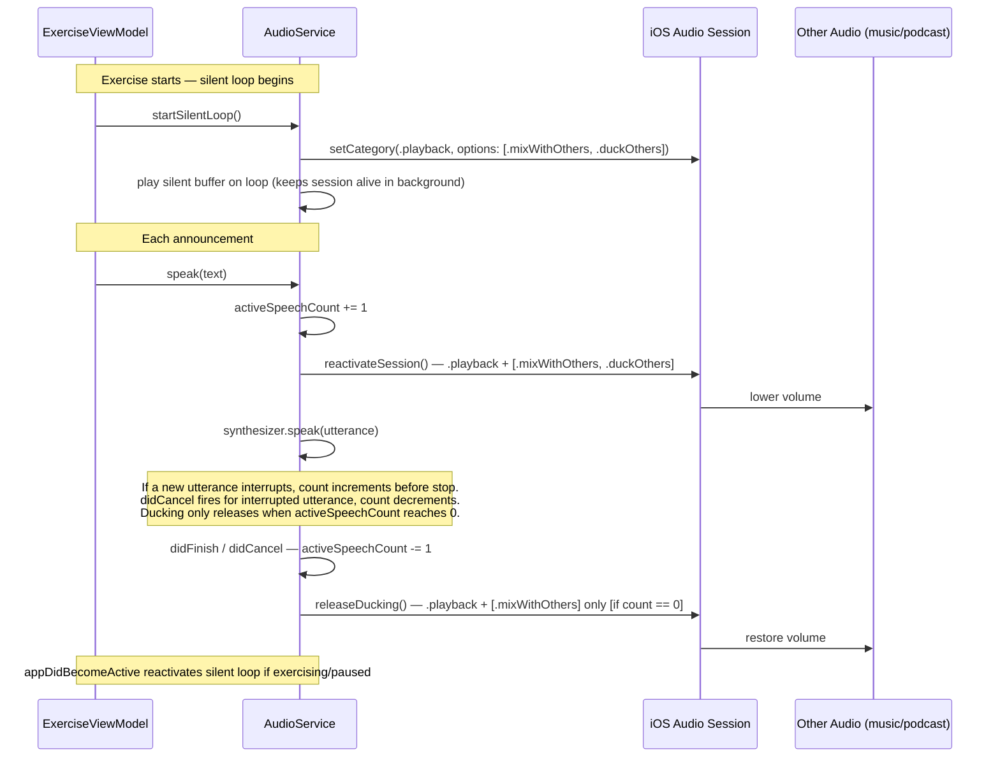
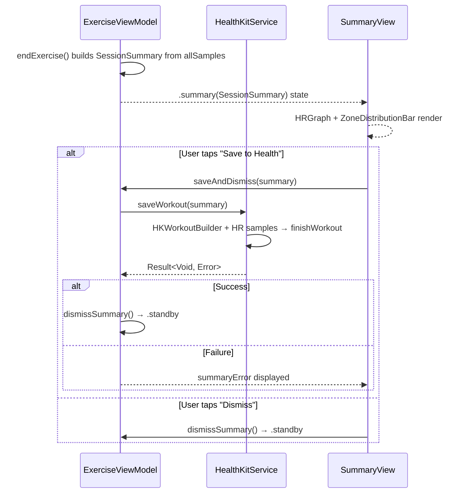
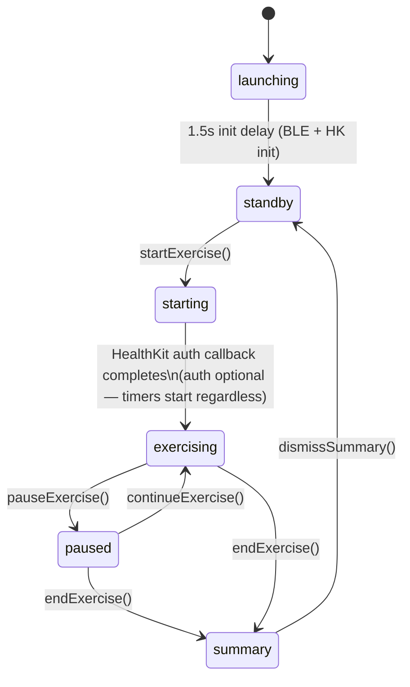

# BeatZone — Architecture

## Overview

BeatZone is a SwiftUI iOS app built around a single `ObservableObject` ViewModel (`ExerciseViewModel`) that owns all runtime state. Views are thin and purely reactive. Services are protocol-backed for testability: `AudioServiceProtocol` and `HealthKitServicing` enable test-double injection. `BLEHeartRateService` is a concrete class (not protocol-backed) injected directly. `WorkoutManager` suppresses the idle timer during exercise.

---

## Module Diagram



---

## Data Flow

### Heart Rate

```mermaid
sequenceDiagram
    participant BLE as BLEHeartRateService
    participant HK as HealthKitService
    participant VM as ExerciseViewModel
    participant AUD as AudioService
    participant EV as ExerciseView

    Note over BLE,VM: BLE scanning starts at VM init (passive discovery mode)
    Note over BLE,VM: On startExercise(), BLE switches to active connection mode
    BLE-->>VM: onHR(bpm) [priority source]
    HK-->>VM: startObservingHeartRate(bpm, date) [fallback — only if hrSource != .ble]
    Note over HK,VM: HK observer query + 5s polling fallback (for Garmin batch writes)
    Note over HK,VM: since: anchor is backdated 10s to tolerate Watch clock skew
    Note over HK,VM: HK observers remain active while paused; only timers stop
    VM->>VM: handleNewHRSample(bpm, source, date)
    VM->>VM: checkZoneBreaches()
    VM->>AUD: speak("Maximum/Minimum heart rate reached") [if zone breached]
    VM-->>EV: @Published currentHR / totalAvgHR / hrSource
```

### HR Source Timeout



### Standby Liveness Polling



### Announcements



### Audio Session



### Session Summary & Workout Saving



---

## App State Machine



> **Note on `starting → exercising`:** `startExercise()` sets `.starting` immediately, then waits 150ms before calling `requestHealthKitAndBegin()`. The transition to `.exercising` happens inside the HealthKit auth callback — whether or not permission was granted. HealthKit observation is registered regardless of whether permission was actually granted (the `granted` parameter from HealthKit reflects whether the dialog was presented, not whether read access was allowed). The `since:` anchor is backdated by 10 seconds (`Date().addingTimeInterval(-10)`) to tolerate Apple Watch sample clock skew — preventing the "frozen 61 bpm" bug where valid initial samples were rejected, while still excluding genuinely stale pre-exercise samples.

---

## BLE Dual-Mode Architecture

`BLEHeartRateService` operates in two distinct modes:

| Mode | Triggered by | Behaviour |
|------|-------------|-----------|
| **Standby (passive discovery)** | `startScanning()` at VM init | Scans with `allowDuplicates` to surface nearby HR monitors. No connection attempted. Drives `bleSourceStatus` on the standby screen. |
| **Exercise (active connection)** | `start()` on exercise start | Connects to discovered or system-connected peripheral. Subscribes to HR characteristic (UUID 2A37). Calls `onHR` callback on each notification. |

**Resilience:** If the peripheral disconnects during exercise (`isExercising && wantsConnection`), the service auto-reconnects immediately. After exercise, `returnToScanning()` disconnects and reverts to passive discovery mode.

---

## File Reference

All source files live under `HeartInterval/HeartInterval/`.

| File | Role |
|---|---|
| `ContentView.swift` | Root view — creates `@StateObject ExerciseViewModel` and routes to the correct view based on `appState` |
| `ExerciseViewModel.swift` | All runtime state, timers, HR logic, announcement settings, zone breach detection, standby polling, HR source timeout |
| `ExerciseView.swift` | Live exercise screen — `HRSpeedometer` gauge, BPM display, HR source badge, staleness indicator, `NoHRWarning` panel (shown after 20s timeout) |
| `StandbyView.swift` | Setup screen — zone slider, speak/summary interval pickers, workout type picker, BLE/Watch source status indicators |
| `PausedView.swift` | Pause screen — frozen metrics via `MetricRow`, end/continue buttons |
| `SummaryView.swift` | Post-exercise summary — `HRGraph` (Canvas line chart with zone bands), `ZoneDistributionBar`, save-to-Health button |
| `SplashView.swift` | Animated launch screen (shown during 1.5s init delay) |
| `StartingView.swift` | Loading indicator shown during exercise start and HealthKit auth |
| `SessionSummary.swift` | Data models: `SessionSummary`, `HRSample`, `WorkoutActivityType` (run/cycle/rowing/hiit/skiing/other) |
| `BLEHeartRateService.swift` | Dual-mode BLE: passive standby scanning + active exercise connection with auto-reconnect |
| `HealthKitService.swift` | Reads HR from Apple Health (observer query + 5s polling fallback); standby liveness polling; workout saving via `HKWorkoutBuilder` |
| `AudioService.swift` | TTS announcements with audio session ducking; `AudioServiceProtocol` enables test injection |
| `WorkoutManager.swift` | Suppresses idle timer during exercise |
| `HRRangeSlider.swift` | Custom dual-handle zone slider (80–180 bpm, 5 bpm steps) |
| `MetricRow.swift` | Reusable animated metric display component |
| `HeartIntervalApp.swift` | App entry point |

> Simulator builds include a mock HR timer (`#if targetEnvironment(simulator)`) in `ExerciseViewModel` that feeds synthetic BPM values so the exercise screen can be tested without a real HR monitor.

---

## Planned Additions

See [PLANNED_IMPROVEMENTS.md](PLANNED_IMPROVEMENTS.md) for the feature roadmap. Key architectural impacts:

- **Session History** — adds a persistence layer (likely a lightweight JSON store or CoreData)
- **HR Zone Time Tracking** — extends `ExerciseViewModel` with zone time counters
- **Rounds Timer** — adds a new timer type and round state to `ExerciseViewModel`; likely a new `RoundView`
- **GPS Tracking** — adds `LocationService` alongside `BLEHeartRateService` and `HealthKitService`; new `MapView` component
