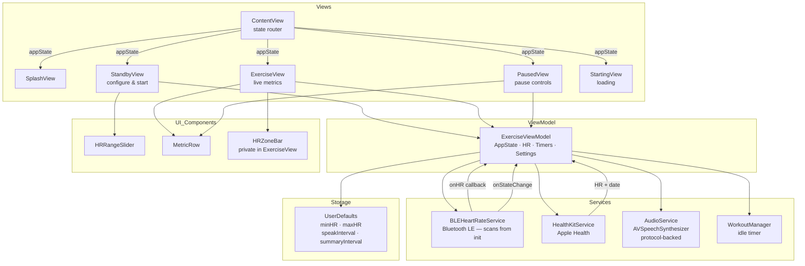
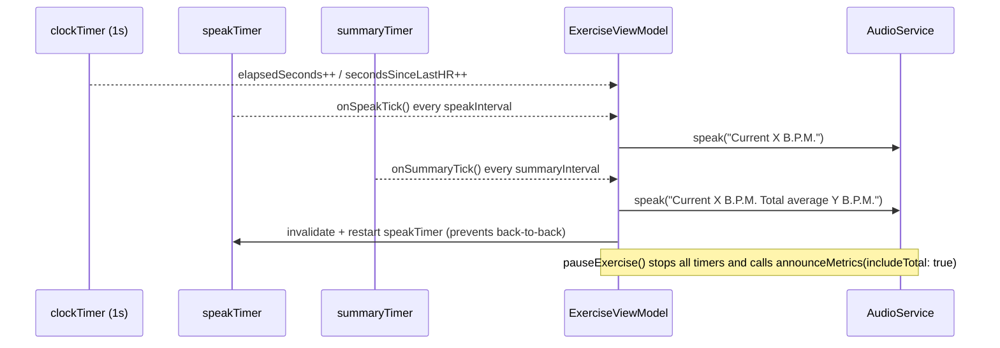
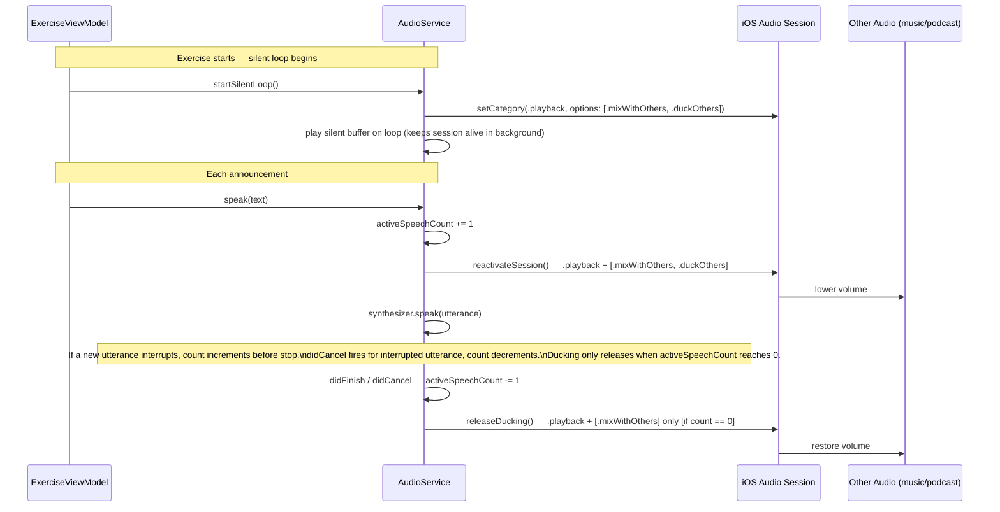
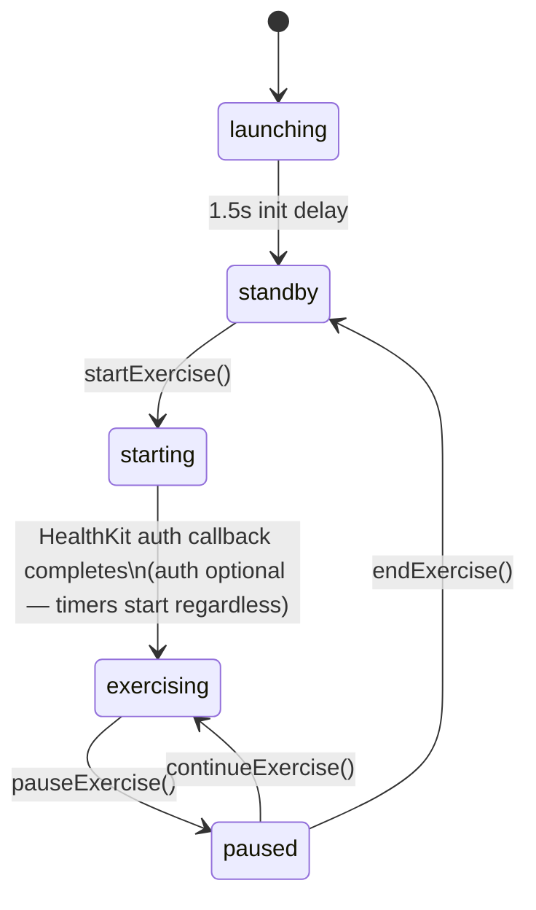

# BeatZone — Architecture

## Overview

BeatZone is a SwiftUI iOS app built around a single `ObservableObject` ViewModel (`ExerciseViewModel`) that owns all runtime state. Views are thin and purely reactive. `AudioService` is protocol-backed for testability; `BLEHeartRateService` and `HealthKitService` are concrete classes injected directly.

---

## Module Diagram



---

## Data Flow

### Heart Rate

```mermaid
sequenceDiagram
    participant BLE as BLEHeartRateService
    participant HK as HealthKitService
    participant VM as ExerciseViewModel
    participant AUD as AudioService
    participant EV as ExerciseView

    Note over BLE,VM: BLE scanning starts at VM init, before standby
    BLE-->>VM: onHR(bpm) [priority source]
    HK-->>VM: startObservingHeartRate(bpm, date) [fallback — only if no BLE]
    Note over HK,VM: HK observers remain active while paused; only timers stop
    VM->>VM: handleNewHRSample(bpm, source)
    VM->>VM: checkZoneBreaches()
    VM->>AUD: speak("Maximum/Minimum heart rate reached") [if zone breached]
    VM-->>EV: @Published currentHR / totalAvgHR / hrSource
```

### Announcements



### Audio Session



---

## App State Machine



> **Note on `starting → exercising`:** `startExercise()` sets `.starting` immediately, then waits 150ms before calling `requestHealthKitAndBegin()`. The transition to `.exercising` happens inside the HealthKit auth callback — whether or not permission was granted. HealthKit observation is only registered if permission was granted. The duration of `.starting` is unpredictable as it includes any system auth UI shown to the user.

---

## File Reference

All source files live under `HeartInterval/HeartInterval/`.

| File | Role |
|---|---|
| `ContentView.swift` | Root view — creates `@StateObject ExerciseViewModel` and routes to the correct view based on `appState` |
| `ExerciseViewModel.swift` | All runtime state, timers, HR logic, announcement settings |
| `ExerciseView.swift` | Live exercise screen — progress ring, BPM display, zone bar (`HRZoneBar` is a private struct here) |
| `StandbyView.swift` | Setup screen — zone slider, speak/summary interval pickers |
| `PausedView.swift` | Pause screen — frozen metrics, end/continue buttons |
| `SplashView.swift` | Animated launch screen |
| `StartingView.swift` | Loading indicator shown during exercise start and HealthKit auth |
| `BLEHeartRateService.swift` | Scans and connects to BLE HR monitors; scanning starts at VM init |
| `HealthKitService.swift` | Reads HR from Apple Health / Apple Watch; observer query + 5s polling fallback |
| `AudioService.swift` | TTS announcements with audio session ducking; `AudioServiceProtocol` enables test injection |
| `WorkoutManager.swift` | Suppresses idle timer during exercise |
| `HRRangeSlider.swift` | Custom dual-handle zone slider (80–180 bpm, 5 bpm steps) |
| `MetricRow.swift` | Reusable animated metric display component |
| `HeartIntervalApp.swift` | App entry point |

> Simulator builds include a mock HR timer (`#if targetEnvironment(simulator)`) in `ExerciseViewModel` that feeds synthetic BPM values so the exercise screen can be tested without a real HR monitor.

---

## Planned Additions

See [PLANNED_IMPROVEMENTS.md](PLANNED_IMPROVEMENTS.md) for the feature roadmap. Key architectural impacts:

- **Session History** — adds a persistence layer (likely a lightweight JSON store or CoreData)
- **HR Zone Time Tracking** — extends `ExerciseViewModel` with zone time counters
- **Rounds Timer** — adds a new timer type and round state to `ExerciseViewModel`; likely a new `RoundView`
- **GPS Tracking** — adds `LocationService` alongside `BLEHeartRateService` and `HealthKitService`; new `MapView` component
